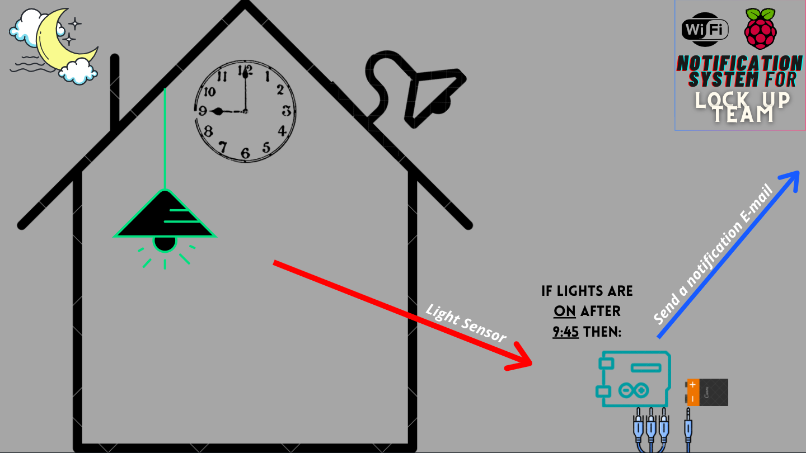
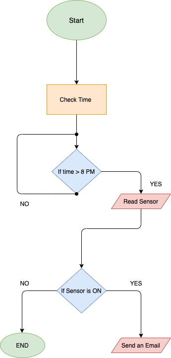
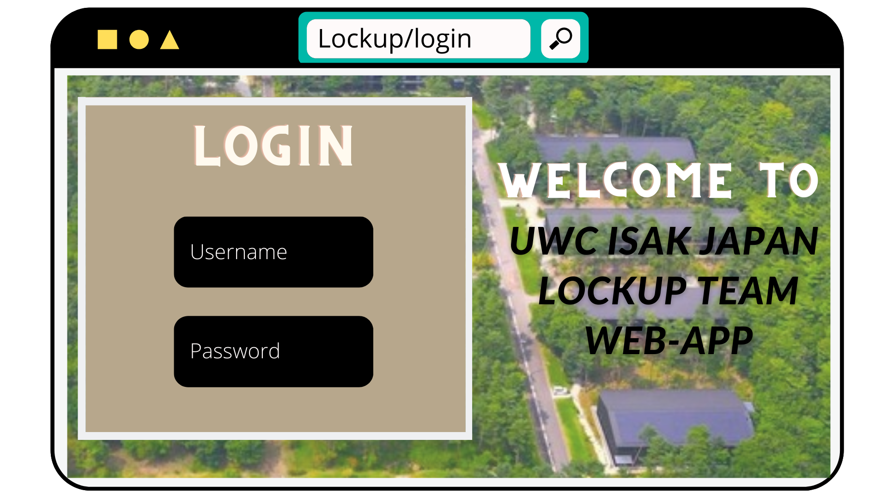

**1. The prototype to expand the idea more on how the system will work:** 

**2 The Flow diagram of the code checking the light sensor. **

# UI Design Protorype: 

### Login Page: 
This is the UI design for the first page of the Web-Application, where the user will be able to login and access the rest of the app. 

 

### Home Page: 
Here is the home page for the Web-app, the user will be able to check if the lights are on in a certin room by hovering at an item, note that
each room is represented through an item, the small gym is the weights and the main cort is a volleyball, the equipment room is a mat. and when hovering at an item
either ON or OFF will turn Yellow to show that its statu. 

 .png)
