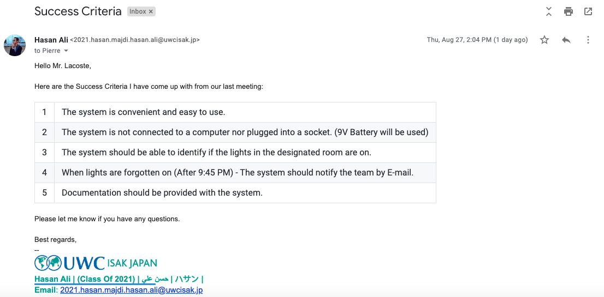
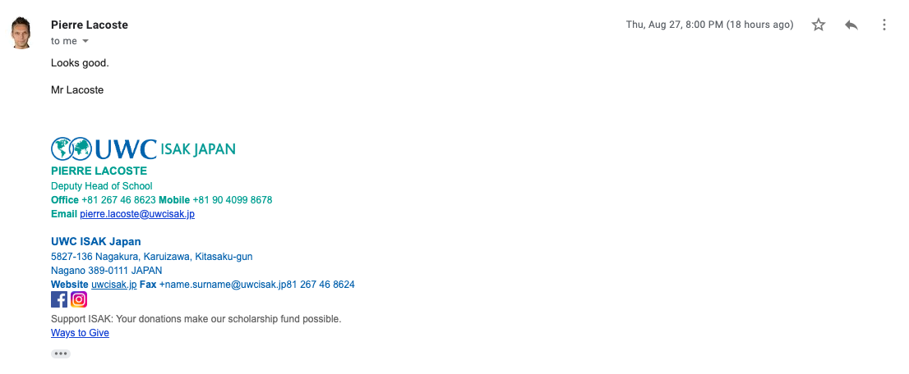

**Email sent by the Developer with Success Criteria:** 

 

___
### After adjustments: 

| No. | Success Criteria                                                                             |
|:---:|----------------------------------------------------------------------------------------------|
| 1   | The system is accecieble throgh a web-application.                                           |
| 2   | The user can check the statu of the lights anytime during the day.                           |
| 3   | The user should be able to check if the lights in the designated room are on.                |
| 4   | When lights are forgotten on (After 9:45 PM) - System should notify the team by E-mail.      |
| 5   | System should be provided with a proper Documentation should be provided with the system.    |
| 6   | User is able to check the history of the hours the the lights has been on for.               |
| 7   | UI should be interactive for the user, which means animation of buildings will be provided.  | 
| 8   | Web-App should be secure, which means that only the team members and the administrator are able to acess the system.|

**confirmation Email recived from the client agreeing on the Success Criteria:**

 
